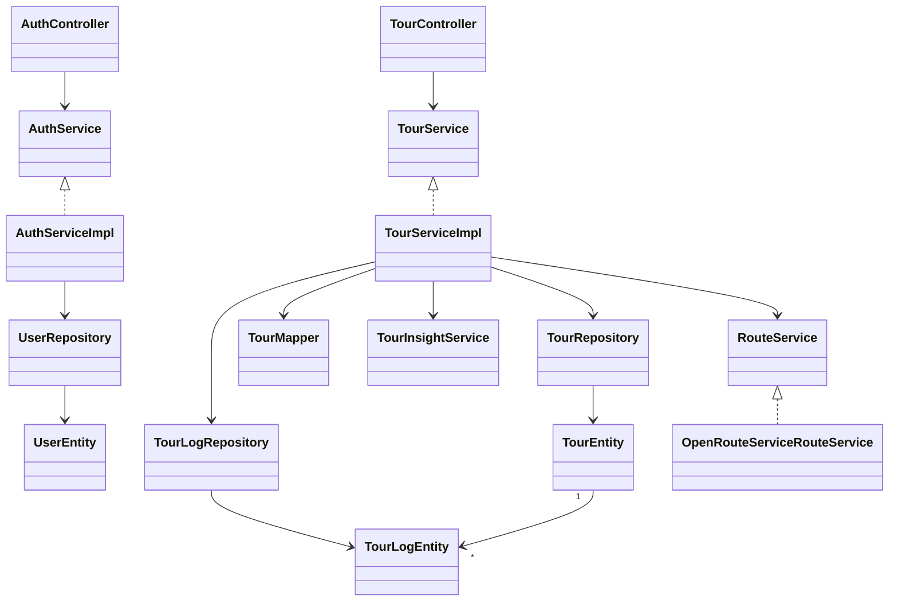
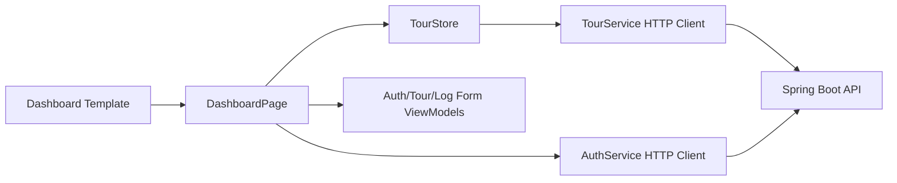
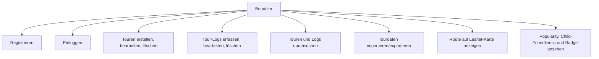
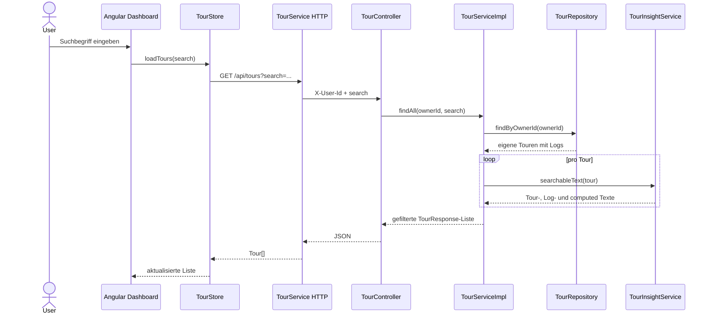

# Tour Planner - Final Protocol

Git Repository: https://github.com/salimsn/swen2-tourplanner.git

## 1. Ziel und Scope

Tour Planner ist eine zweischichtige Webanwendung mit Angular im Frontend und Spring Boot im Backend. Benutzer können sich registrieren, einloggen, eigene Touren planen, Logs für absolvierte Touren erfassen, Tourdaten durchsuchen, importieren und exportieren.

Die finale Iteration ergänzt gegenüber der Zwischenabgabe die fehlende Business-Logik: Benutzertrennung, OpenRouteService-Anbindung, Leaflet-Karte, benutzerfreundliche Routenerstellung über Ortsnamen, automatische Distanz- und Zeitberechnung je Transporttyp, Volltextsuche, berechnete Attribute, JSON-Import/Export, Unique Feature und mehr als 20 Unit Tests.

## 2. Technische Entscheidungen

| Bereich | Entscheidung | Begründung |
| --- | --- | --- |
| Backend | Java 21 + Spring Boot | Erfüllt Middleware- und Java-Anforderung, gute REST/JPA-Unterstützung |
| Frontend | Angular Standalone Components | Web-Framework, klare Komponentenstruktur, Reactive Forms |
| UI Pattern | MVVM | `TourStore`, `TourFormViewModel`, `TourLogFormViewModel`, `AuthFormViewModel` kapseln UI-State und Form-Logik |
| Persistenz | Spring Data JPA + PostgreSQL | OR-Mapper und PostgreSQL gemäß Spezifikation |
| Tests | JUnit/Spring Boot Test | Kritische Business- und Persistenzflüsse werden gegen H2 getestet |
| Logging | Log4j2 | Zentraler technischer Log-Stack für Services und Fehlerbehandlung |
| Karten | Leaflet + GeoJSON | Standardlösung für Webkarten; Routen werden als GeoJSON angezeigt |
| Routen | `RouteService` + OpenRouteService | API-Anbindung ist austauschbar und testbar; Distanz und Zeit werden nicht manuell gepflegt |
| Import/Export | JSON | Einfach versionierbar, lesbar und ohne Zusatzbibliotheken nutzbar |

## 3. Architektur

Das Backend nutzt eine Layered Architecture:

```text
Controller -> Service -> Repository -> Database
```

Controller kennen keine Datenbankdetails. Services kapseln Business-Logik, Owner-Isolation, Suche, Import/Export, Routing und Logging. Repositories kapseln den Datenzugriff über JPA.

### Class Diagram



### Frontend MVVM



## 4. Use Cases



## 5. Sequence Diagram - Full-Text Search



## 6. UI Flow und Wireframes

### Login und Register

```text
+--------------------------------------+
| Tour Planner                         |
| [ Login | Registrieren ]             |
| Benutzername                         |
| Passwort                             |
| [Einloggen]                          |
+--------------------------------------+
```

### Dashboard

```text
+---------------------------+---------------------------------------------+
| Sidebar                   | Content                                     |
| User + Logout             | Tour Header + Edit/Delete                  |
| Suche                     | Route/Transport/Distanz/Zeit               |
| Import/Export             | Insights: Popularity, Child Score, Badge   |
| Tourliste                 | Leaflet Map + Bild                         |
| + Neue Tour               | Tour Logs + Log-Form                       |
+---------------------------+---------------------------------------------+
```

Bei kleinen Viewports wird die Sidebar oberhalb des Content-Bereichs gestapelt. Die Tour-Detailbereiche nutzen responsive Grid-Spalten.

## 7. Design Patterns

- MVVM im Frontend: ViewModels und Store halten UI-State und Formularlogik aus dem Template heraus.
- Repository Pattern: Spring Data Repositories kapseln DAL.
- Mapper Pattern: `TourMapper` kapselt DTO/Entity-Transformation.
- Strategy/Port Pattern: `RouteService` ist ein Interface, `OpenRouteServiceRouteService` ist die konkrete Implementierung.
- DTO Pattern: Request/Response/Export Records trennen API-Modell von Entity-Modell.

## 8. OpenRouteService und Leaflet

`OpenRouteServiceRouteService` verwendet die ORS-Geocoding- und Directions-API, wenn `ORS_ENABLED=true` und `ORS_API_KEY` gesetzt sind. Start, Ziel und optionale Zwischenstopps werden als Ortsnamen eingegeben und vor der Directions-Abfrage geocodiert. Die API liefert anschließend Distanz, Dauer und Routengeometrie passend zum Transportprofil. Unterstützt werden nur Transportarten, die sauber auf ORS-Profile abbildbar sind: `CAR` auf `driving-car`, `BIKE` auf `cycling-regular` und `HIKE`/`RUNNING` auf `foot-walking`. In Tests und lokaler Entwicklung ohne Key greift ein Fallback, damit die Anwendung lauffähig bleibt und keine externen Requests benötigt.

Das Frontend rendert `routeGeoJson` mit Leaflet. Die Karte ist nicht nur ein Platzhalter: Sie initialisiert eine Leaflet-Map, lädt OpenStreetMap-Tiles und zeichnet die echte Route als GeoJSON-Linie statt nur eine Luftlinie.

## 9. Berechnete Attribute und Unique Feature

Popularity wird aus der Anzahl der Logs abgeleitet. Child-Friendliness berücksichtigt geplante Distanz, geschätzte Zeit, Transporttyp und die gemeldeten Schwierigkeiten und Zeiten in Logs. Die Distanz eines Logs wird aus der zugehörigen Tour übernommen, damit keine widersprüchlichen Distanzen entstehen.

Die Bewertung ist transportabhängig: Bei `BIKE`, `HIKE` und `RUNNING` wirkt sich Distanz stärker aus, weil sie körperlich relevant ist. Bei `CAR` zählt die Fahrzeit stärker als die Distanz, damit eine normale Autostrecke nicht fälschlich wie eine sportliche Ausdauerroute bewertet wird.

Unique Feature: automatische Achievement Badges. Beispiele:

- `Community favorite`
- `Endurance route`
- `Quick win`
- `Family pick`
- `Explorer`
- `Family drive`
- `Comfort pick`
- `Road trip`
- `Scenic drive`

Diese Badges werden im Detailbereich angezeigt und sind auch Teil der Volltextsuche.

## 10. Unit-Test-Entscheidungen

Es wurden 31 Backend-Tests umgesetzt. Die Tests decken kritische Bereiche ab:

- Auth: Registrierung, Login, Duplikate, falsches Passwort
- Owner-Isolation: fremde Touren sind nicht sichtbar oder änderbar
- Tour CRUD und Log CRUD
- Cascade Delete von Logs
- Volltextsuche über Tourdaten, Logdaten und computed Werte
- Import/Export inklusive Logs und Owner-Zuordnung
- Berechnung von Popularity, Child-Friendliness und Badges
- Transportabhängige Child-Friendliness- und Badge-Bewertung für Autotouren
- Application Context Smoke Test

Diese Bereiche sind kritisch, weil Fehler hier direkt zu Datenverlust, Datenschutzproblemen, falscher Bewertung oder nicht erfüllten Must-Haves führen würden.

Frontend-Tests prüfen den Angular-Shell-Start. Zusätzlich wurde der Angular-Production-Build ausgeführt.

## 11. Fehler und Lösungen

| Problem | Lösung |
| --- | --- |
| ORS darf in Tests nicht extern aufgerufen werden | `ORS_ENABLED=false` im Testprofil und Fallback im RouteService |
| Benutzertrennung fehlte in der Zwischenversion | `X-User-Id` Header und `findByIdAndOwnerId` im Repository |
| Suche musste computed Werte berücksichtigen | `TourInsightService.searchableText()` kombiniert Tour, Logs und Insights |
| Leaflet sollte ohne Angular-Package-Installation funktionieren | Leaflet wird im `index.html` geladen und in `RouteMapComponent` gekapselt |
| Bilder sollen nicht als Blob in DB landen | DB speichert nur `imagePath`, Basisverzeichnis liegt in Konfiguration |
| Distanz und Zeit sollten nicht manuell eingegeben werden | `RouteService` berechnet beides beim Speichern aus Start, Ziel, Stopps und Transporttyp |
| API-Key darf nicht auf GitHub landen | `.env` ist ignoriert, `.env.example` enthält nur Platzhalter |
| Zug und Flugzeug sind keine stabilen ORS-Directions-Profile | `TRAIN` und `PLANE` wurden entfernt; unterstützt werden `CAR`, `BIKE`, `HIKE`, `RUNNING` |
| Autostrecken wurden wie sportliche Ausdauerrouten bewertet | `TourInsightService` verwendet eigene Distanz-/Zeit-Abzüge und eigene Badges für `CAR` |

## 12. Zeittracking

| Arbeitspaket | Zeit |
| --- | ---: |
| Analyse Spezifikation und Checkliste | 1.0 h |
| Backend Auth und Owner-Isolation | 2.0 h |
| ORS/RouteService und Leaflet-Integration | 2.0 h |
| Benutzerfreundliche Routenerstellung und automatische Distanz/Zeit | 1.0 h |
| Suche, computed Attributes, Unique Feature | 2.0 h |
| Transportbereinigung und Auto-spezifische Insights | 0.5 h |
| Import/Export | 1.0 h |
| Frontend Login, Dashboard, Suche, Import/Export | 2.5 h |
| Unit Tests und Debugging | 2.5 h |
| Dokumentation, UML, Wireframes | 1.5 h |
| Gesamt | 16.0 h |

## 13. Verifikation

Backend:

```text
Tests run: 31, Failures: 0, Errors: 0, Skipped: 0
```

Frontend:

```text
Angular build: erfolgreich
Frontend tests: 2 passed
```
